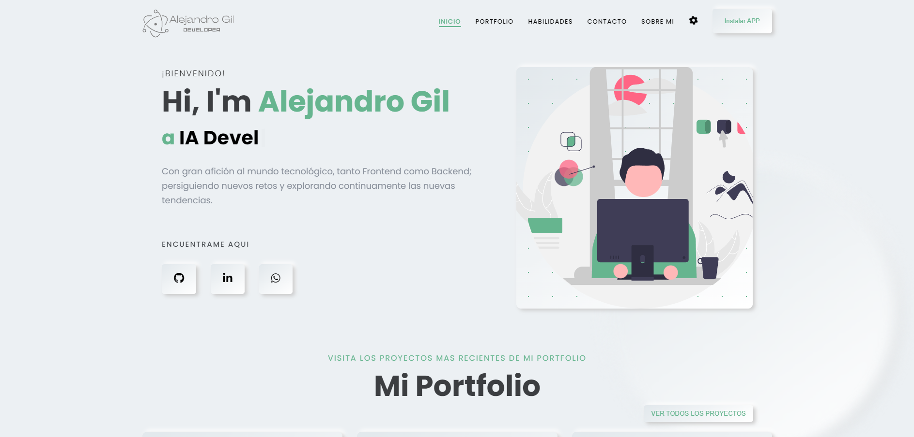
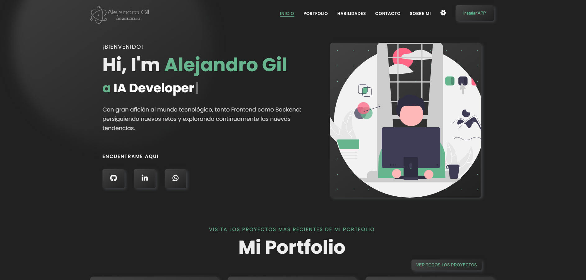

# **Alejandro Gil PORTAFOLIO**

Este proyecto es mi portfolio profesional donde muestro mis skills, que experiencia tengo y en que me estoy especializando.

Este portfolio es una PWA, asi que puedes instalar la aplicacion en tu dispositivo.

## **CAPTURAS**

## **DEMO**

Puede ver el demo de este haciendo click [aquí](https://alejandrogil.netlify.app/).

## **TECNOLOGIAS**

Para el portfolio utilice las siguientes tecnologias:

- ReactJS
- Modules CSS
- Netlify
- PWA
